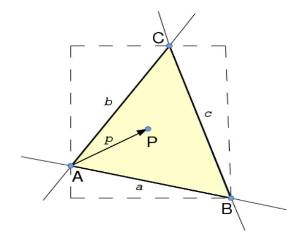
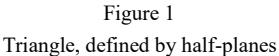
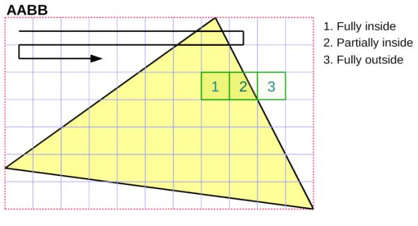
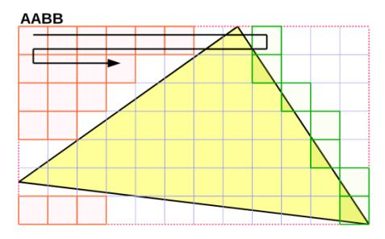
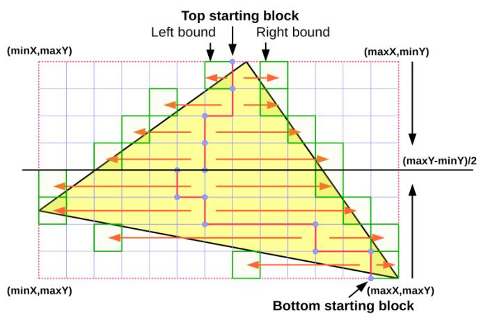
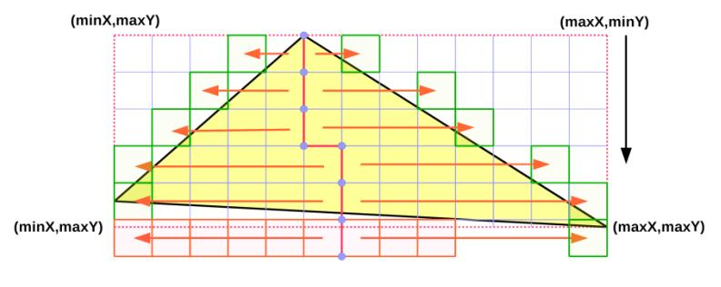
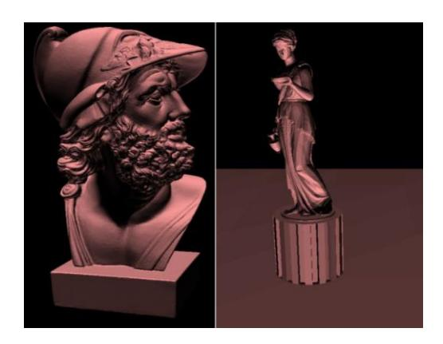

# **加速半空间三角形光栅化**

## Péter Mileff, Károly Nehéz, Judit Dudra

University of Miskolc, Department of Information Technology, Miskolc-Egyetemváros, 3515 Miskolc, Hungary, mileff@iit.uni-miskolc.hu

University of Miskolc, Department of Information Engineering, Miskolc-Egyetemváros, 3515 Miskolc, Hungary, aitnehez@uni-miskolc.hu

Bay Zoltán Nonprofit Ltd. for Applied Research, Engineering Division (BAY-ENG), Department of Structural Integrity and Production Technologies, Iglói út 2, 3519 Miskolc, Hungary, judit.dudra@bayzoltan.hu

> *摘要: 在过去的十年间，图形处理器（GPU）已主导了交互式计算机图形和可视化技术领域。多年来，成熟的工具与编程接口（如 OpenGL, DirectX API）极大地便利了开发者工作，因为这些框架提供了所有基础可视化算法。本研究的目标是开发一种基于传统 CPU 的纯软件光栅化渲染器。尽管当前其性能相比 GPU 存在诸多不足，但现代多核系统的普及和平台多样性可能需要此类实现方案。本文聚焦于三角形光栅化这一渲染流程的核心环节，通过建立新型模型优化方案，并结合现有技术的改进与创新，显著提升了经典半空间光栅化算法的性能。所提出的技术方案在图形编辑器乃至计算机游戏等领域均具备应用潜力。*
> 
> *关键词: 半空间光栅化; 二分算法; 软件渲染* 

#### 1 **介绍**

计算机可视化技术的历史可追溯至数十年前，但其重要性在近年尤为凸显。如今，从传统台式计算机到移动及嵌入式设备，先进图形特性几乎无处不在。这一发展成果源于漫长的技术演进，主要动力来自于图形处理器的出现。早期计算机可视化仅依赖低速 CPU 完成整个光栅化流程的所有环节，而当今该任务已由图形加速卡（目标硬件）全面接管。该领域的主要演进方向受到专业计算机游戏、媒体产业以及日益增长的 CAD/CAM 系统需求的共同推动与主导。

However, we should not forget about the recent development of CPUs. Modern CPUs have many advanced features due to multi-core technology and the extended instruction set (e.g. SSE, AVX). Besides the development of the instruction set and the increase of central cores, another important result is the appearance of DDR4 type memories in 2014. Although these types are one order of magnitude faster than older DDR3 RAMs, still cannot compete with the DDR5 type memory equipped in modern video cards. Nevertheless it is a significant step forward to improve the speed of memory operations. The continuous development of CPU technology encourages software developers to reconsider the structure and logical model of their existing graphical applications. The usage of a multi-thread game engine model is essential for today's AAA-type computer games. Developers of the most advanced graphics engines (Unreal Engine, CryEngine, Frostbite, etc.) have already recognized the potential of these new opportunities. The question may arise, whether it makes sense to deal with CPU-based solutions if powerful GPUs are available today. The answer has already been given by leading video game developers. Some modern games apply the CPU to perform specific tasks to reduce GPU load. Software occlusion culling - where the CPU is used to render polygons to occlusion buffer rather than the GPU - is a good example of this hybrid approach. Several well-known games (e.g. KillZone 3, Battlefield 3, etc.) and game engines (e.g. CryEngine) apply similar technologies because CPUs have no latency problem of occlusion queries. Rasterization is usually done in small resolution (e.g. Battlefield uses  $256 \times 114$ ) and occlusion testing can be done using a hierarchical software z-buffer [^12] [^19].

Using all this as a starting point, the central question that motivates this paper is how to improve one of the fundamental visualization algorithms, i.e. a polygon fill based rasterization on CPUs. Our objective is to propose algorithms and extensions for the half-space rasterization model, which can serve as the basis of a graphics engine applying more complex, possibly a hybrid graphics pipeline using CPU for specific tasks.

#### 2 **Related Works**

Software based rendering prospered between the end of the 90s and the beginning of the 2000's. Due to the appearance of GPUs, only a few papers (although an increasing number of) that involve the CPU in the visualisation process have been published in recent years. Most of these papers discuss general display algorithms or shader oriented GPU specific solutions which cannot be applied on CPUs in their original form.

During the early years of the rendering (1996-1998) ID Software and Epic Games achieved remarkable results in the area of modern software based computer graphics. Both companies have become famous for their high performance and complex graphics engine offering high quality visualization solutions (e.g. colored lighting, shadowing, volumetric lighting, fog, pixel accurate culling, etc.). These engines were optimized for the Intel Pentium MMX processor family and their rendering system was based on the scanline-based polygon filling approach applying several additional technologies (e.g. BSP tree), so as to provide high performance. After the continuous spreading of GPU-based rendering, software rendering was pushed more and more into the background. Nevertheless, some great results, e.g. Pixomatic Renderer developed by Rad Game Tools and the Swiftshader [2] by TransGaming were achieved. Both products are fully DirectX 9 compatible, very complex and highly optimized taking advantage of multi-core threading possibilities of modern CPUs. Their pixel pipeline can continuously modify itself adapting to the actual rendering tasks. Since these products are all proprietary, the details of their architectures are not available for the general public. By developing DirectX, Microsoft provided the basis for the spread of GPU technologies, and it also developed a software rasterizer called WARP [3]. The renderer is capable of taking advantage of multi-threads and in some cases it is even able to outperform low-end integrated graphics cards.

In 2008, based on problem and demand investigations, Intel aimed to develop its  $x86$  based video card within the Larrabee project [5]. In a technological sense, the card was a hybrid of the multi-core CPUs and GPUs. Its purpose was to provide x86 cores-based, fully programmable pipeline with 16-byte-wide SIMD vector units. The new architecture made it possible for graphic calculations to be programmed in a more flexible way than GPUs with an x86 instruction set.

Other researchers proposed optimization of the triangle traversal algorithms, and new rasterization models have been introduced. As a part of current results, Hengyong Jiangl et al. [13] proposed a midpoint triangle rasterization traversal algorithm, which reduces the number of traversal points and improves the efficiency of graphics acceleration. Their approach is demonstrated by an FPGA. Pablo et al. investigated and compared three different triangle traversal algorithms (Box, Zig-zag, Hilbert Curve based) in terms of performance and they simulated them in Matlab using ModelSim [22]. Their experimental results show that important area-performance trade-offs can be met, when implementing key image processing algorithms in hardware. Chih-Hao Sun et al. [15] demonstrated an edge equation based tile-scan triangle traversal algorithm. In their solution, the basic functions of parameter interpolation and rasterization can be executed with a universal shared hardware to reduce the cost of rendering. By hardware sharing and architecture design techniques of pipelining and scheduling, their algorithm can meet real-time requirements for graphics applications at reasonable hardware costs. An entirely new approach was presented by Olano et al., which is a simplified solution for triangle scan conversion applying 2D homogeneous coordinates for fast real-time rendering [17]. Their solution avoids costly clipping tests and can render true homogeneous triangles significantly faster than previous implementations. As a part of the new generation of parallel algorithms, Zack Bethel outlined a modern, multi-thread tile based software rendering technique

using a block-based half-space theory where only the CPU is used for calculations, which led to performance improvements [1]. The FreePipe Software Rasterizer [9] focuses on multi-fragment effects, where each thread processes one input triangle, determines its pixel coverage, and performs shading and blending sequentially for each pixel. Due to the evolution of GPGPU, the idea of performing software rendering by GPGPU has been raised several times. NVidia proposed and investigated an efficient CUDA-based rendering model [6], the performance of which is a factor of 2-8x compared to the hardware graphics pipeline.

In recent years, major companies in the game industry have recognized the potential of the CPU again [11]. Their game engine can delegate certain visualization tasks to the CPU. In the game Battlefield 3 a SPU-based deferred shading model was developed [12], where the objective was to use SPUs to distribute shading work and offload GPU. In 2011, the game Killzone 3 supports complex occluded environments. To cull non-visible geometry early in the frame, the game uses PlayStation 3 SPUs to rasterize a conservative depth buffer and performs fast synchronous occlusion queries against it  $[16]$ . The topic of software occlusion culling has been investigated also by Intel Software in the paper [18]. It presents a Killzone-like solution, but it is built upon an x86 basis and optimized for SSE Streaming extensions.

Thus, as recent findings show, CPU-based approaches put an emphasis on again to increase flexibility and performance. This paper investigates the optimization and extensions of the triangle traversal and filling algorithm.

#### 3 **Basics of Rasterization**

The aim of computer visualization is to display pixel sets (e.g. 2D image or projected 3D objects) on the screen. The type of rendering algorithm or the procedure of a presentable element largely depends on the applied hardware or software based visualisation model. Rasterization is a very intensive process computationally, especially when the visual element also contains an alpha channel [7] [21].

Several approaches have been developed to represent shapes in memory, but nowadays the most prevalent and most widely applied object representation is the polygon mesh. During the modelling process the object is usually divided into convex polygons, like triangles. Still, the rendering performance largely depends on the applied rasterization algorithm. Although several different solutions have been developed (Ray tracing, Volume Rendering, etc.), currently GPU manufacturers use triangle filling based models in real-time visualisation. This method allows significantly faster rendering than for example ray based algorithms.

#### 3.1 **Triangle-based Filling**

In a classical sense filling is performed pixel by pixel, so the inner iteration and the various calculations need to be executed many times. Although the vertex mapping and the traversal of the process seem to be simple, the filling performance largely depends on the implemented algorithm and its optimization level. We can state that it is a huge challenge to implement an algorithm, which takes the possibilities of the modern CPU hardware into account and being highly optimized at the same time. The parts of the filling model affect each other in a complex form. The smallest change in the iteration logic can result in up to more than a 10% performance difference.

Nowadays there are two widespread triangle filling algorithms: the scanline and the half-space based algorithms. The main idea of the previous scanline approach was to walk triangle line by line (scanline) from top to bottom. Each row represents a line, whose starting and ending points are the intersections of the triangle sides and the scanline along the  $x$  axis. The end points of the line can be calculated incrementally using the slope values of the edges.

The scanline algorithm is widely used and can be optimized (e.g. s-buffer), but it is difficult to adapt it to current hardware opportunities. The rasterization is performed line by line, which has several unpleasant consequences for both hardware and software implementation. One of these problems is that the algorithm is asymmetric in  $x$  and  $y$  directions. In the case of thin triangles, the performance may significantly vary between the horizontal and vertical orientation. The outer scanline loop is serial, which is not favourable for hardware implementation. The inner loop, which is responsible for scanline iteration is not so SIMD-friendly because of the different line lengths. This makes the algorithm orientation-dependent. Processing several lines at the same time for some reason (e.g. Mipmapping, Multisampling) would mean further complications for calculations. To sum up, the solution is hard to apply for parallel processing of lines and pixels. A better solution would be if pixels were processed in 2x2 blocks (quads), the expected increase in the performance would be significant.

Next, the paper focuses on the other approach, the half-space based triangle traversal, where the basic algorithm and further optimization points are presented which improves performance to a large extent.

#### 4 **Half-Space Rasterization**

The name of this model is not unified in literature; some sources refer to it as a point in a triangle, a bounding box or a half-plane algorithm. The basic idea of the model originates from the polygon convexity: the interior of a convex polygon formed by  $n$  number of edges can be defined as the intersection of the  $n$  half spaces.

For triangles, the three half-planes clearly define the inner area.
  


Several mathematical approaches describe the inner pixels of the triangle and they all examine the question of how to describe edges. In the following a 'Perp Dot' product-based model is presented. The Perp Dot product [20] is the twodimensional equivalent of the three dimensional cross-products. It is a product between two vectors in two dimensions and is obtained by taking the dot product of one vector with the perpendicular one of the other. The perpendicular vector is simply a vector at right angles to the vector it is based on with the same magnitude. The definition of the formula for two-dimensional vectors and applying it to  $a$ ,  $b$  vectors is the following:

$$perpDotP(a,b) = a^{\perp} \cdot b = a_x b_y - a_y b_x = \begin{vmatrix} a_x & a_y \\ b_x & b_y \end{vmatrix}.$$
 (1)

The result is a scalar, which has specific properties:

- $perpDotP(a, b) = 0 \rightarrow a, b$  are parallel
- $perpDotP(a, b) > 0 \rightarrow b$  is counterclockwise from a
- $perpDotP(a, b) < 0 \rightarrow a$  is counterclockwise from b  $\bullet$

These properties are useful to determine whether a pixel is inside the triangle or not. In the case of a P point, the product needs to be calculated with all the three edges and to check its sign,

$$c_1 = perpDotP(a, p), c_2 = perpDotP(b, p), c_3 = perpDotP(c, p).$$

The final point-triangle containment relation depends on the prior knowledge of the triangle:

- $\bullet$ if the vertices A, B, C are given in clockwise order, then P is inside the triangle if  $c_1 > 0$  &&  $c_2 > 0$  &&  $c_3 > 0$
- if the vertices A, B, C are given in counter-clockwise order, then P is inside the triangle if  $c_1 < 0$  &&  $c_2 < 0$  &&  $c_3 < 0$
- if the order of the vertices A, B, C is unknown, then P is inside the  $\bullet$ triangle if

 $(c_1 > 0 \&\& c_2 > 0 \&\& c_3 > 0 \mid c_1 < 0 \&\& c_2 < 0 \&\& c_3 < 0)$ 

#### $4.1$ **The Simple Filling Approach**

Based on the equations above, a simple filling algorithm can be formulated. First of all a bounded area is needed to specify which set of pixels is required to travel. We can use the area of the render target (e.g. screen buffer), but it requires a lot of unnecessary iterations. A better solution is if we use the axis aligned bounding box of the triangle. The pseudo code of the algorithm:

```
<pre>Calculate triangle bounding box (minX,minY,maxX,maxY);</pre>
<pre>Clip box against render target bounds(minX,minY,maxX,maxY);</pre>
Loop i=minX to maxX
  Loop j=minY to maxY
        P = P (i, j);c1 = perpDotProduct (\overline{AC}, \overline{AP});
        c2 = perpDotProduct(\overline{BC}, \overline{BP});
        c3 = perpDotProduct (\overline{CB}, \overline{CP});
        if (c1 >= 0 and c2 >= 0 and c3 >= 0)
            renderPixel(P);
   end
end
```

As the first step, the algorithm calculates the axis-aligned bounding box of the triangle and performs the clipping according to the bounds of the render target. In the second part of the process, all the points of the bounding box are crawled. Applying the above Perp Dot product formula the pixel-triangle containment relation can be determined.

Firstly, it is important to emphasize that this model is simple and easy to understand. Due to the bounding box the lines have the same length. Therefore. this approach is more SIMD friendly than the classical scanline algorithm. Taking advantage of the symmetry of the lines the model is much more parallel-friendly, the block or tile-based approach can be used more effectively. The processing logic is highly customizable for the CPUs used currently.

Although the basic algorithm seems simple, the model is not recommended in practice for several reasons (slow performance, lack of sub-pixel precision and filling rules). The main disadvantage is that the solution also travels unnecessary pixels, which means a lot of superfluous iterations in case of large and elongated triangles. The performance at these types of triangles will be significantly lower.

In the following, new approaches and optimizations will be presented, which dramatically improve the performance of the basic algorithm making it suitable for real-time games and other graphics-intensive applications.

#### **Optimization Considerations** $\mathbf{5}$

Developing a fast rasterizer is a complex task, high-level and multi-layered (code and logic level) optimization is required. In order to achieve really good results, full graphics pipeline optimization should be performed. However, the present paper focuses on improving the rasterization performance. The rasterization process constitutes the dominant part of the total performance requirement of the image synthesis [21]. Thus, any kind of performance improvement (even eliminating a division) affects the final result significantly.

Optimization should be performed on the basis of Michael Abrash's idea: 'Assume nothing' [4]; any logical considerations and their results can only be justified by measurements; the assumptions themselves are not acceptable. During the optimization process two main goals can be set for the filling algorithm:

- The key issue is the acceleration of the calculations and iterations  $\bullet$ because the basic algorithm is not efficient in CPU time.
- A more effective solution is required to traverse the pixels of the  $\bullet$ bounding box

#### $$ **Incremental Approach**

One of the main problems of the simple filling model is that the pixel by pixel filling performed in the double iteration loop is extremely expensive computationally. To optimize these loops, let us start from the calculation of the Perp Dot product determinant. Based on the formula (1), the relationship of a point  $P$  and edge  $AB$  can be described as follows:

$$\begin{vmatrix} B_x - A_y & P_x - A_x \ B_y - A_y & P_y - A_y \end{vmatrix} = (B_x - A_x)(P_y - A_y) - (B_y - A_y)(P_x - A_x).$$
 (2)

Performing the multiplications and by rearranging the factors (2) can be written  $\mathbf{a}$ 

$$F_{01}(P) := (A_y - B_y)P_x + (B_x - A_x)P_y + (A_xB_y - A_yB_x).$$
 (3)

The resulting equation is called edge function. Examining the factors, if the vertex positions are constants, the function is linear for  $P$ . The other two edge functions applying the same transformation are the following:

$$F_{12}(P) := (B_y - C_y)P_x + (C_x - B_x)P_y + (B_x C_y - B_y C_x),$$
(4)

$$F_{20}(P) := (C_y - A_y)P_x + (A_x - C_x)P_y + (C_x A_y - C_y A_x).$$
 (5)

If a triangle is counter-clockwise, then every edge function is positive for  $P$ , and the point is inside the triangle.  $F_{01}$  equation can be simplified by introducing additional constant:

$$I_{01} := A_y - B_y,\tag{6}$$

$$J_{01} := B_x - A_x,\tag{7}$$

$$K_{01} := A_x B_y - A_y B_x. \tag{8}$$

By substituting:

$$F_{01}(P_x, P_y) = I_{01}P_x + J_{01}P_y + K_{01}.$$
(9)

During the iteration we travel row by row: move one pixel to the right, then one pixel up or down. Because  $F_{01}$  is linear, axis-aligned unit steps can be calculated in both directions by using the introduced constants  $(6)$   $(7)$   $(8)$ :

$$F_{01}(P_x + 1, P_y) - F_{01}(P_x, P_y) = I_{01},$$
(10)

$$F_{01}(P_x, P_y + 1) - F_{01}(P_x, P_y) = J_{01}.$$
(11)

If we move one pixel to the right,  $I_{01}$  should be added to the edge function. If we move one pixel up or down then  $J_{01}$  is the additive tag. Following the above logic, the pseudo implementation of the iteration-based and modified filling algorithm is as follows:

```
Calculate triangle bounding box (minX, minY, maxX, maxY);
Clip box against render target bounds (minX, minY, maxX,
maxY);Const.: I_{01}, J_{01}, K_{01}, I_{02}, J_{02}, K_{02}, I_{03}, J_{03}, K_{03}, F_{01}, F_{02}, F_{03}Cy1=F01; Cy2=F02; Cy3=F03;
Loop j=minY to maxY step 1
      Cx1=Cy1; Cx2=Cy2; Cx3=Cy3;
      Loop i=minX to maxX step 1
              if (Cx1 > 0 and Cx2 > 0 and Cx3 > 0 )
                  RenderPixel(P);<pre>// Inner loop increments</pre>
              Cx1 -= I01; Cx2 -= I02; Cx3 -= I03;end
       <pre>// Outer loop increments</pre>
      Cy1 += J01; Cy2 += J02; Cy3 += J03;end
```

#### $5.2$ **A Block-oriented Half-Space Rasterization Model**

The performance requirement of rasterization is caused by travelling all the pixels of the bounding box because the box also contains pixels, which are outside the triangle. Therefore, it is expedient to propose an extension of the basic model, by which these pixels can be skipped. However, it is important to note that only those logical approaches can be applied which can be quickly evaluated and executed. Any operation executed in a double iteration loop and storing additional intermediate states has a negative impact on the performance. In such cases the cost of travelling unnecessary pixels will be less than the execution of control logic. In the following an efficient block-based traversal algorithm will be presented.

The unnecessary calculations can really be reduced, if the traversal process is performed on larger pixel sets. To achieve this, the triangle bounding box should be divided into squares which will be the basic units of the traversal logic. Figure 2 shows the essence of the block-based traversal method:



Figure 2 Block-based triangle covering

The smallest unit of iteration is a block. The algorithm is performed from top to bottom, row by row and the top-left block can be chosen as the starting point of the traversal. This approach provides an opportunity for the pixel-triangle containment relation to be performed at a block level. It is sufficient to investigate only the four corners of the square. On this basis, there are three cases:

- every corner of the block is outside the triangle;  $1.$
- $2.$ the block overlaps the triangle;
- $\mathfrak{Z}$ the block is completely inside the triangle.

The first case is the most favourable because in this case there is no need for additional calculation on writing pixels into the framebuffer. The block can be skipped entirely. The second case is the worst, where the pixel-triangle containment calculation needs to be done for each pixel in the block, and according to the results the color of the pixel should be calculated. This part of the algorithm is essentially the same as the basic, pixel-level filling. Case 3 is also favourable for traversal. Since each pixel of the block falls within the triangle, there is no need to calculate the edge functions per pixel or do the containment verification. Only the color of the pixels should be determined. The iteration also allows an additional supplement. When the edge of a triangle is reached in a row,

we can move straight to the next row because only empty blocks can be found from this position.

This traversal logic is simple, the block-level iteration does not require complex calculations: only a state should be stored and an additional condition check is required. Practical experience shows that the extra computing capacity for executing the logic is slightly smaller than the cost of checking blocks to the end of the row. However, the same solution cannot be applied for improving performance of the pixel level processing inside a block type 2. Although it seems appropriate, it degrades the performance.

The following pseudo code shows the logic of the algorithm:

```
<pre>Calculate triangle bounding box (minX, minY, maxX, maxY);</pre>
<pre>Clip box against render target bounds (minX, minY, maxX, maxY);</pre>
Loop j=minY to maxY step=q
    Loop i=minX to maxX step=q
       <pre>// Block corners</pre>
       C1x=i; C1y=(i+q-1) C2y=j; C2x=(j+q-1);
       if C1x, C2x, C1v, C2v all outside the triangle then
          continue:
       \! // Fully covered blocks
       if C1x, C2x, C1y, C2y all inside the triangle then
           RenderBlock(i,j,q);
           continue;
       end
       // Partially covered blocks
       Loop k=j to q step=1
           Loop l=i to q step=1 \frac{1}{2}if pixel(k, 1) inside the triangle
                   RenderPixel(k,l):
           end
       endendend
```

The key element of the algorithm is the iteration block size. If the block size is too small, then the block-level calculations require more computing capacity than checking only simple pixels. If large block size is chosen, then there will be fewer triangles which fulfil cases 1 or 3. Therefore, the block-based traversal does not result in any performance improvement. Practical measurement experience shows that an 8x8 block size typically provides accurate results.

The efficiency of the process can significantly be affected by the orientation of the triangles. If the presented triangle mesh consists of large polygons, or the camera view is close to a polygon, then the vast majority of the blocks will be in the triangle (case 3). In this case, rasterization can be very fast, especially when applying a SIMD instruction set in performance critical parts. However, if narrow triangles are dominating, there will be no notable speed improvement because the number of overlapping blocks is increasing (case 2).

Investigating modern computer games, it can clearly be seen that mainly pixellevel effects are dominating (bump/normal/parallax mapping, etc.). Wherever possible, programmers apply screen space pixel transformations instead of increasing the number of polygons. Therefore, the block-based approach is well applicable.

#### $5.2.1$ **Benefits of the Block-based Model**

The advantage of this approach is that during the process a lot of pixels outside the triangle can be excluded from rasterization. The solution reduces the number of iterations in the bounding box, which can fundamentally be a performanceenhancing factor. Certain operations like perspective correct texture mapping or mipmapping can be performed in larger units applying linear interpolation. It is also favourable for visibility determination algorithms. In addition, a hidden advantage of the block-based approach is that it allows a more localized memory access and efficient CPU cache usage because data are located close each other. The reduction of cache misses represents a further performance improvement [10]. Finally, it should not be forgotten that the block-based model is much more parallel-friendly. Due to the distribution of operations to several threads, the block as a larger unit has important advantages.

#### $5.3$ **An Adaptive Half-Space Rasterization Model**

The presented pixel- and block-level models can be applied in any triangle orientation. However, their efficiency is unbalanced. The algorithm handling only pixels is less efficient in the case of large triangles and the performance of the block-based approach is not sufficient in the case of thin triangles. Another performance-enhancing factor could be, if an adaptive model was used in accordance with the characteristics of the triangle and changes were made in the applied rasterization method dynamically. The precondition for this is to determine the characteristic of the triangle.

It is expedient to define two groups: triangles, which are narrow and those which correspond to the block-oriented approach. The orientation can be defined by introducing a metric based on the bounding box of the triangle:

$$orient_{\Delta} = \frac{BB_{max} - BB_{minx}}{BB_{max} - BB_{miny}}$$
 (12)

The definition of the formula is intentionally simple because rasterization setup costs should be kept at a minimum level. The orientation is a positive number. Its value is 1 if the bounding box is a rectangle. If the width is dominant, the value of the ratio increases and if the height is dominant, the value will be reduced. We can state that triangles with a ratio close to one are ideal for the block-based model, if their size reaches at least one block along the  $x$  or  $y$  axis. The more we move away from this value the more advisable it is to use the pixel-based algorithm. On this basis, a range for switching between the two methods can be determined by experience. Experience shows that it is triangles with orient values of  $0.4 - 1.6$  that should be rasterized with the block-based approach, in all other cases the pixelbased algorithm is recommended.

The adaptive algorithm is especially advantageous since it is always the preferred model that is applied of the two. Therefore, the rasterization performance can be significantly increased.

#### $5.4$ **Problem of Empty Blocks**

Although the block-based approach significantly helps to travel the empty area of the bounding box faster, the number of traversed empty blocks is still significant and superfluous. The following example illustrates the problem well:



Figure 3 Block-based covering with empty block coloring

In Figure 3, the orange color indicates the traversed empty blocks. Since the algorithm always starts the investigation of the rows from the left of the bounding box, it travels several empty blocks before reaching the edges. Although these calculations are computationally less intensive than reading or writing pixels, but in the case of a complex scene a significant amount of unnecessary calculations are involved. In the above example (Figure 3), there are 18 completely empty blocks of all the 84, which is 21% of all the blocks. To reduce the traversal of the empty area, several approaches have been developed, where the ZigZag [22] and Backtrack [7] are the most widely known algorithms. Both algorithms perform rasterization at pixel level and their main characteristic is that they exclude unnecessary traversal at only one side of the triangle. However, on the other side, when stepping to the next row, they are not able to skip every empty pixel in many cases. In addition, the traversal direction changes row by row, which requires storing more states and increasing the number of conditions (CPU branching can be slow if statements are unpredictable).

#### $5.5$ **A Block-based Bisector Half-Space Rasterization Model**

In the following a block-based algorithm is presented which aims to minimize the number of traversed empty blocks and thus to reduce unnecessary calculations. Figure 4 explains the essence of the traversal.

The basic idea is that the problem of empty-block minimization can effectively be solved if the traversal starts from a common point inside the triangle and moves in two directions. The filling is divided into two directions along the y axis of the bounding box and performed from top to bottom, bottom to top and to half of the hox.



Figure 4 Triangle traversal logic of the Bisector algorithm

The bidirectional traversal at row level starts from the inside out until an empty block is reached. The starting block of the next row is calculated from the first two blocks found outside the edges at the previous row:

#### $Start$ block = Left bound + (Right bound - Left bound) / 2. $(14)$

It is important to note that, if the starting block does not fall on a block boundary, then rounding is also required. The division by two can significantly increase the load. Therefore, in implementations it is expedient to use fixed-point arithmetic because starting block can be calculated without division and with block boundary alignment:

$$Start block \leftarrow (Left + (Right - Left) \gg 1) \& \sim (q - 1). \tag{15}$$

The traversal to the right direction starts from this block and the left starts filling from the previous block. The first row is special because there is no information available from the previous row. In this case, the  $x$  coordinate of the topmost vertex aligned to block boundary can be used as a starting block because it is inside the triangle. The initial state cannot be affected if two vertices of the

triangle are located at the top of the bounding box. Selecting either of them provides accurate results because these points are located at the edges of the bounding box.

Because of the block nature of the algorithm, due to the nature of the triangle edges, the iteration to the left will not find any fillable block if only one block can be filled in the first row. In this case, the value of the 'Left bound' takes the boundary coordinates of the bounding box and based on  $(15)$  the next row will definitely start at an outside block until the traversal reaches the interior of the triangle along the y axis. This is a serious problem because it increases the traversed empty blocks. To remedy this, the algorithm requires a further extension: the value of the 'Left bound' should only be changed if any inside block is found during the left directed traversal. Otherwise, its position should not be updated, so the next row also starts from the block of the previous 'Left bound', from the x coordinate of the topmost vertex.

The next key element of the algorithm is the requirement of the bottom-up traversal. Figure 5 illustrates the basic problem performing only the top-bottom crawling.



Figure 5 The inefficiency problem of the top-bottom only traversal

In cases when an edge of the triangle is very flat, the calculation of a new middle block at the next row will result in an outside block (last row in Figure 5). The best case for the traversal would be when the middle block arrives at the corner of the bottom edges, but it cannot be guaranteed because the middle point is defined by the previous row. Therefore, the number of traversed empty blocks can increase.

The solution is offered by the bottom-up traversal of the lower part of the triangle. As the starting block can exactly be determined from the x coordinate of the bottommost vertex at this time, the traversal of the empty blocks seen in Figure 5 is completely eliminable like in Figure 4.

Although the solution appears complex, it does not require any complicated calculations and the control logic is simple. The algorithm effectively minimizes

the traversal of the empty blocks. The pseudo-code of the full algorithm is as follows:

```
Calculate triangle bounding box (minX, minY, maxX, maxY);
Clip box against render target bounds (minX, minY, maxX, maxY);
Find Topmost vertex, calculate leftPoint and rightPoint
halfY = minY + ((maxY - minY) >> 1) & \sim (q - 1);BlockSize = q;Loop j=minY to (halfY + BlockSize) step=BlockSize
   midPoint = leftPoint + ((rightPoint-leftPoint) >> 1) & ~ (BlockSize - 1);x = midpoint;Loop k=0 to 2 step=1
      Loop x to (q > 0 ? x < maxX : x > minX - BlockSize) step=q
          <pre>// Block corners</pre>
          C1x=x; C1y=(x+BlockSize-1) C2y=j; C2x=(j+BlockSize-1);
          if C1x, C2x, C1y, C2y all outside the triangle then
             continue;
          \! // Fully covered blocks
          if C1x, C2x, C1y, C2y all inside the triangle then
            RenderBlock(x, j, BlockSize);
            continue;
          endRenderPartiallyCoveredBlock(j,x, BlockSize);
       end
       q = -q;if k==0 then rightPoint = x - BlockSize;
      else leftPoint = x + BlockSize;
      x = midpoint - BlockSize;\hspace{15pt}\texttt{end}end
Find Bottommost vertex, calculate leftPoint and rightPoint
Loop j=maxY &~(BlockSize-1) to halfY step=-BlockSize
Repeat the above part
end
```

#### **Practical Experience and Results** 6

To evaluate the above rasterization models from a practical point of view, a single-threaded pipeline architecture was developed. Although it is possible to apply distributed approaches in several parts of the pipeline, this paper only focuses on accelerating single-threaded pixel operations.

#### $6.1$ **The Test Environment**

The sample programs were written in  $C++$  applying the GCC 4.8.1 compiler and the measurements were performed by an Intel Core i7-870 2.93 GHz CPU in a 64 bit Windows 7 environment. The implemented pipeline does not contain any hand-optimized SIMD code parts, only the compiler-optimized code was applied. The chosen screen resolution and color depth were 1024x768x32 in windowed mode and the used hardware for the test was an ATI Radeon HD 5670 with 1 GB of RAM. The software framebuffer was defined as a 32 bit unsigned integer array aligned to 16 bytes. This made an effective pixel handling possible, which stored the four components of a pixel together  $[21]$  to make memory operations faster. The prototype application used a software z-buffer and backface culling to solve visible surface determination, but texture mapping had not been implemented yet. To illuminate objects, the Lambertian reflectance was applied and rasterization used a top-left convention for filling.

#### $6.2$ **Benchmark Results**

During benchmarking, several different test cases were prepared. Each of them represented a special group of tasks frequently occurring in practice. The measured results are cumulated values calculated from the average frame rates (FPS) during a 20 sec running period. The distance of the models from the camera affects the performance largely. When an object is farther away, usually many small triangles should be drawn. However, getting closer to the camera, the projection of the polygons will be larger and the number of fillable pixels is increasing. Test Cases for benchmark:

Case 1: low poly model located farther from the camera.

Case 2: low poly model located close to the camera. The polygons cover about the 80% of screen pixels.

Case 3: high poly model built from small triangles (head) located farther from the camera

Case 4: high poly model built from small triangles (head) located close to the camera. The polygons cover the entire screen.

Case 5: medium poly model (statue) cover about the 80% of screen pixels. The model contains both small and large triangles.

Table 1 summarizes the results achieved by different types of rasterization algorithms. The test results show that the basic half-space algorithm is proved to be the slowest in every case as expected. Through its simplicity, it does not contain any optimizations. The incremental based approach can be regarded as a transition, its performance converges to the other, better solutions. If we examine the block-based model, it can be seen that during the tests C3 and C4 its performance was not satisfactory. The main reason for this is the nature of the scenes.



Figure 6 Part of the sample models: head (196.602 triangles), statue (95.346 triangles)

| Table 1           |  |
|-------------------|--|
| Benchmark results |  |

|                          | <b>Benchmarks (FPS)</b>              |                           |                                  |                   |                                              |  |
|--------------------------|--------------------------------------|---------------------------|----------------------------------|-------------------|----------------------------------------------|--|
| Test                     | <b>Half-space algorithm variants</b> |                           |                                  |                   |                                              |  |
| cases                    | Simple<br>rasterizer                 | Incremental<br>rasterizer | <b>Block-based</b><br>rasterizer | Adaptive<br>model | Adaptive and<br><b>Bisector</b><br>algorithm |  |
| $\rm C~1$                | 112                                  | 294                       | 456                              | $506$             | 517                                          |  |
| C2                       | 58                                   | 165                       | 552                              | 552               | 564                                          |  |
| C3                       | 60                                   | 67                        | 51                               | 67                | 69                                           |  |
| C4                       | $23$                                 | 37                        | 35                               | $40$              | $45$                                         |  |
| $\mathbf{C}\;\mathbf{5}$ | 69                                   | 97                        | 106                              | 125               | 132                                          |  |

These tests used high poly models built up from small triangles, which cannot be managed effectively by the block-based algorithm (the number of partially covered blocks increase). The adaptive model variant proved its efficiency in all cases. The logic of its triangle-orientation-based decision was able to maintain the high level performance. The fastest solution is achieved by the combination of adaptive and bisector algorithms. This made it also possible to take advantage of the reduction of empty blocks.

### **Conclusion**

Although present day rasterization is almost exclusively performed by GPUs, we cannot forget the opportunities offered by modern CPUs. It should be recognized that certain functions can and should also be shared between GPU and CPU in order to make a more effective and robust rasterization model. To bring the two sides more closely together, this paper highlighted the basic problems of visualization. We can see that developing a fast and effective rendering model is not trivial, there are many difficulties. The authors presented some new variants of the classic half-space triangle rasterization model, which fits much better with modern CPUs and can be a good basis for developing a more complex rasterizer, for example a hybrid pipeline between GPU and CPU. In the future, it is expected that many applications will be released using a similar technology.

## **Acknowledgements**

This research was carried out as part of the TAMOP-4.2.1.B-10/2/KONV-2010-0001 project with support by the European Union, co-financed by the European Social Fund.

## References

- [^1] Bethel, Z.: A Modern Approach to Software Rasterization. University  $\lceil 1 \rceil$ Workshop, Taylor University, December 14, 2011
- TransGaming Inc: Why the Future of 3D Graphics is in Software, White  $\lceil 2 \rceil$ Paper: Swiftshader technology, Jan 29, 2013
- $[3]$ Microsoft Corporation: Windows Advanced Rasterization Platform (WARP) guide. 2012
- Abrash, M.: Rasterization on larrabee. Dr. Dobbs Portal, 2009  $[4]$
- $[5]$ Seiler, L., Carmean, D., Sprangle, E., Forsyth, T., Abrash, M., Dubey, P., Junkins, S., Lake, A., Sugerman, J., Cavin, R., Espasa, R., Grochowski, E., Juan, T., Hanrahan, P.: Larrabee: a Many-Core x86 Architecture for Visual Computing. ACM Transactions on Graphics (TOG) - Proceedings of ACM SIGGRAPH 2008 Volume 27 Issue 3, August 2008
- Laine, S., Karras T.: High-Performance Software Rasterization on GPUs.  $[6]$ High Performance Graphics, Vancouver, Canada, August 5, 2011
- $[7]$ Akenine-möller, T., haines, E.: Real-Time Rendering, A. K. Peters. 3<sup>rd</sup> Edition, 2008
- Sugerman, J., Fatahalian, K., Boulos, S., Akeley, K., and Hanrahan, P.: [8] Gramps: A Programming Model for Graphics Pipelines. ACM Trans. Graph. 28, 4:1–4:11, 2009
- $[9]$ Fang, L., Mengcheng H., Xuehui L., Enhua W.: FreePipe: A Programmable, Parallel Rendering Architecture for Efficient Multi-Fragment Effects. In Proceedings of ACM SIGGRAPH Symposium on Interactive 3D Graphics and Games, 2010
- [10] Agner, F.: Optimizing Software in  $C^{++}$  An Optimization Guide for Windows, Linux and Mac platforms. Study at Copenhagen University College of Engineering, 2014
- Swenney, T.: The End of the GPU Roadmap. Proceedings of the  $\lceil 11 \rceil$ Conference on High Performance Graphics, 2009, pp. 45-52

- $\lceil 12 \rceil$ Coffin, C.: SPU-based Deferred Shading for Battlefield 3 on Playstation 3. Game Developer Conference Presentation, March 8, 2011
- Xuzhi W., Feng G., Mengyao, Z.: A More Efficient Triangle Rasterization  $\lceil 13 \rceil$ Algorithm Implemented in FPGA, Audio, Language and Image Processing (ICALIP), July 16-18, 2012
- McCormack J., McNamara R.: Tiled Polygon Traversal Using Half-Plane  $\lceil 14 \rceil$ Edge Functions. **HWWS**  $'00$ Proceedings  $\overline{of}$ the  $ACM$ SIGGRAPH/EUROGRAPHICS workshop on Graphics hardware, 2000, pp. 15-21
- [15] Chih-Hao, S., You-Ming, T., Ka-Hang, L., Shao-Yi, C.: Universal Rasterizer with Edge Equations and Tile-Scan Triangle Traversal Algorithm for Graphics Processing Units, In proceeding of: Proceedings of the 2009 IEEE International Conference on Multimedia and Expo, 2009
- Valient, M.: Practical Occlusion Culling in Killzone 3, Siggraph 2011,  $\lceil 16 \rceil$ Vancouver, Oct. 14, 2011
- $\lceil 17 \rceil$ Olano, M., Trey, G.: Triangle Scan Conversion Using 2D Homogeneous Coordinates, Proceedings of the 1997 SIGGRAPH/Eurographics Workshop on Graphics Hardware, ACM SIGGRAPH, New York, August 2-4, 1997
- $[18]$ Chandrasekaran, C.: Software Occlusion Culling, Intel Developer Zone, Jan 14, 2013
- Leone, M., Barbagallo, L.: Implementing Software Occlusion Culling for  $\lceil 19 \rceil$ Real-Time Applications, XVIII Argentine Congress on Computer Sciences, Oct. 9., 2012
- Hill, F. S. Jr.: The Pleasures of 'Perp Dot' Products. Chapter II.5 in  $\lceil 20 \rceil$ Graphics Gems IV (Ed. P. S. Heckbert) San Diego: Academic Press, 1994, pp. 138-148
- $\lceil 21 \rceil$ Mileff, P., Dudra, J.: Advanced 2D Rasterization on Modern CPUs, Applied Information Science, Engineering and Technology: Selected Topics from the Field of Production Information Engineering and IT for Manufacturing: Theory and Practice, Series: Topics in Intelligent Engineering and Informatics, Vol. 7, Chapter 5, Springer International publishing, 2014, pp. 63-79

- [22] Royer, P., Ituero, P., Lopez-Vallejo, M., Barrio, Carlos A. L.: Implementation Tradeoffs of Triangle Traversal Algorithms for Graphics Processing, Design of Circuits and Integrated Systems (DCIS), Madrid, Spain; November 26-28, 2014

